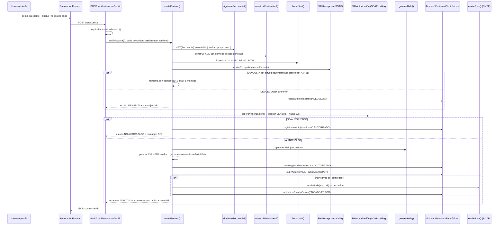

# Auditoría de solo lectura — Módulo de Facturación Electrónica SRI

**Fecha:** 2026-07-06
**Rama:** `audit/facturacion-fase16`
**Alcance:** Paso 0 de la Fase 16 (cuenta unificada → facturación). Solo lectura de código. No se ejecutó ningún flujo, no se llamó al SRI, no se modificó ningún archivo ni registro de Airtable.
**Metodología:** Toda la evidencia de esquema de Airtable (nombres de tabla y de campo) proviene de lectura directa del código fuente que ya construye esos requests (`lib/facturacion/airtable/*.ts`, `lib/cuenta-unificada/index.ts`, `lib/shipping-v2/schema.generated.ts`), no de una llamada en vivo a la API de metadatos de Airtable — el código es evidencia de primera mano de qué campos lee/escribe la aplicación hoy.

---

## Resumen ejecutivo

El módulo de facturación electrónica (`lib/facturacion/`, `app/api/facturacion/`, `app/facturacion/`) está **completo y probado en ambiente de pruebas (celcer)**: arma el XML v2.1.0, lo firma XAdES-BES con un `.p12` local, lo envía y consulta autorización al SRI vía SOAP, genera el RIDE en PDF, lo envía por correo (SMTP) y persiste todo (Airtable + disco, retención legal) con numeración anti-duplicados y recuperación ante fallos. Los 12 endpoints del módulo tienen guard de sesión (`requireFacturacionSession`) — no hay endpoints de facturación expuestos sin autenticación.

**Estado frente al gancho de Fase 16:** el módulo es hoy una isla deliberada. `lib/facturacion/airtable/productos.ts` documenta explícitamente la decisión de no tocar inventario ("la emisión de facturas no afecta el inventario... se implementará en un flujo separado"). No existe ninguna conexión de código entre facturación y Operación Comercial / Órdenes / Abonos / Shipping Finanzas Movimientos. Sí existe ya, desde la Fase 11, un servicio `getCuentaUnificada()` (`lib/cuenta-unificada/index.ts`) que calcula items, servicios, abonos y saldo de la pareja Orden↔Operación, y ese servicio vive en la **misma base de Airtable** (`AIRTABLE_BASE_ID`) que la tabla "Facturas Electrónicas" y que "Shipping Items" — es decir, no hay fricción de credenciales/base entre los dos mundos, solo falta el código que traduzca `CuentaUnificada` → `DatosVenta`.

**Riesgos principales para el diseño del gancho:**
1. `DatosVenta.detalles` no distingue producto vs. servicio ni trae código de IVA por tipo de ítem — hoy ese código de IVA lo elige un humano línea por línea en el formulario.
2. `Shipping Items` no tiene un campo `Facturado`; su `Estado Item` incluye `"Vendido"` pero nada relaciona ese estado con una factura emitida. El propio código deja un TODO: todos los productos se facturan hoy a IVA 15% fijo porque Shipping Items no tiene campo de tarifa de IVA.
3. `emitirFactura()` es un flujo de **solo emisión al SRI**: nunca escribe en Shipping Items ni en ninguna tabla de inventario/cuenta — cualquier descuento de stock al facturar es responsabilidad 100% del código nuevo de Fase 16.
4. La validación contra el XSD oficial (`validarContraXsd`) existe y está exportada pero **no se invoca** en `emitirFactura()` — solo se usa en tests.
5. El estado `ANULADA` existe en el tipo `EstadoFactura` y en el filtro del historial, pero ningún endpoint ni función lo asigna — no hay flujo de anulación/nota de crédito implementado.
6. Ambiente pruebas/producción es un solo interruptor (`SRI_AMBIENTE`), pero cambiarlo también implica migrar certificado, secuencial y (hoy) forzar el destinatario real de correo — ver sección C.

---

## A. Arquitectura del módulo

### Mapa de archivos

**Páginas (`app/facturacion/`)**
| Archivo | Propósito |
|---|---|
| `app/facturacion/page.tsx` | Pantalla de emisión. Lee `CONSUMIDOR_FINAL_LIMITE` del env y renderiza `FacturacionForm`. |
| `app/facturacion/historial/page.tsx` | Guard de sesión a nivel de página (`canAccessApp(session, "Facturación")`) + `HistorialFacturas`. |

**Rutas API (`app/api/facturacion/`)**
| Ruta | Método | Propósito |
|---|---|---|
| `emitir/route.ts` | POST | Orquesta `emitirFactura()`. `maxDuration=90` (la autorización SRI puede tardar hasta 60s). |
| `clientes/route.ts` | GET/POST | Busca/crea cliente — **delega a `lib/tecnicos/airtable` (tabla "Clientes")**, no a un módulo propio de facturación. |
| `productos/route.ts` | GET | Busca en `Shipping Items` vía `lib/facturacion/airtable/productos.ts` (solo lectura). |
| `borrador/route.ts` | POST | Crea un borrador (`Estado="BORRADOR"`, sin clave de acceso ni secuencial). |
| `borrador/[recordId]/route.ts` | PATCH/DELETE | Editar/eliminar un borrador (verifica `estado === "BORRADOR"` antes de tocarlo). |
| `historial/route.ts` | GET | Lista con filtros (fecha, cliente, número, estado, ambiente). |
| `historial/[recordId]/route.ts` | GET/DELETE | Detalle de una factura / eliminar (solo si `BORRADOR`). |
| `historial/[recordId]/reenviar/route.ts` | POST | Reenvía RIDE+XML por correo leyendo los archivos ya guardados en disco. Solo si `estado === "AUTORIZADO"`. |
| `historial/[recordId]/reintentar/route.ts` | POST | Reconstruye `DatosVenta` desde `Líneas JSON` guardado y vuelve a llamar `emitirFactura()`. Solo para `PENDIENTE`/`RECIBIDA`/`DEVUELTA`. |
| `recuperar/[claveAcceso]/route.ts` | POST | Reconsulta al SRI por clave de acceso y reconstruye el registro si quedó autorizado pero no persistido. |
| `ride/[claveAcceso]/route.ts` | GET | Sirve el PDF desde disco (deriva año/mes de los primeros 8 dígitos de la clave). |
| `xml/[claveAcceso]/route.ts` | GET | Sirve el XML autorizado desde disco. |

**Lógica de servidor (`lib/facturacion/`)**
| Archivo | Propósito |
|---|---|
| `api-auth.ts` | `requireFacturacionSession()` — único guard usado por los 12 endpoints. |
| `config.ts` | Lee todas las env vars `SRI_*`, resuelve endpoints por ambiente. |
| `claveAcceso.ts` | Genera la clave de acceso de 49 dígitos (módulo 11). |
| `types/factura.ts` | Tipos derivados 1:1 del XSD v2.1.0. |
| `xml/construirFacturaXml.ts` | Serializa `FacturaInput` → XML, respetando el orden del XSD. |
| `xml/validarXsd.ts` | Validación contra el XSD oficial — **exportada, no invocada en el flujo real** (solo en tests). |
| `firma/firmar.ts` | Firma XAdES-BES vía `ec-sri-invoice-signer` (node-forge puro, sin binarios nativos). |
| `sri/recepcion.ts` | Cliente SOAP a `RecepcionComprobantesOffline`. |
| `sri/autorizacion.ts` | Cliente SOAP a `AutorizacionComprobantesOffline`. |
| `sri/cola.ts` | `esperarAutorizacion()` — polling con backoff exponencial (2s→4s→8s…, tope 60s). |
| `secuencial/asignar.ts` | `siguienteSecuencial()` — numeración blindada (ver sección B). |
| `almacenamiento/repositorio.ts` | `persistirAutorizado()` / `registrarIntento()` — disco + Airtable. |
| `almacenamiento/recuperar.ts` | Reconstrucción desde el SRI cuando Airtable no llegó a persistir. |
| `ride/generarRide.ts` | Genera el PDF (pdfmake + bwip-js para código de barras). |
| `correo/enviarRide.ts` | Envío por SMTP (nodemailer) del XML+PDF. |
| `airtable/facturas.ts` | Todo el CRUD contra la tabla "Facturas Electrónicas". |
| `airtable/productos.ts` | Búsqueda de solo lectura en "Shipping Items" para el buscador de líneas del formulario. |
| `emitirFactura.ts` | Orquestador de punta a punta (ver diagrama). |
| `index.ts` | Barrel público del módulo. |

**Componentes (`components/facturacion/`)**
| Archivo | Propósito |
|---|---|
| `FacturacionForm.tsx` (1074 líneas) | Formulario de emisión: cliente (consumidor final / buscar / nuevo), líneas manuales o buscadas en Shipping Items, cálculo de totales por tarifa de IVA, bloqueo de consumidor final sobre el límite configurable. |
| `HistorialFacturas.tsx` (768 líneas) | Listado con filtros, acciones "Reenviar correo" y "Reintentar" por fila. |

### Flujo completo de emisión (punta a punta)

### Dónde vive cada pieza SRI

| Pieza | Archivo | Notas |
|---|---|---|
| Armado del XML | `lib/facturacion/xml/construirFacturaXml.ts` | Construcción manual por concatenación de strings, siguiendo estrictamente el orden del XSD (comentado explícitamente: "no reordenar"). |
| Certificado `.p12` | Ruta en `SRI_FIRMA_PATH` (hoy `./private/firma-super-geek.p12`, **fuera del repo** — `private/` y `*.p12` están en `.gitignore`, verificado con `git ls-files`). | Se lee con `fs.readFileSync` en `firma/firmar.ts` en cada emisión (no cacheado en memoria). |
| Firma electrónica | `lib/facturacion/firma/firmar.ts` | Delega a la librería npm `ec-sri-invoice-signer` (XAdES-BES, node-forge puro, sin binarios nativos). |
| Envío/recepción SRI | `lib/facturacion/sri/recepcion.ts` | SOAP manual (construye el envelope a mano, no usa librería SOAP), `fetch` con timeout de 30s. |
| Autorización SRI | `lib/facturacion/sri/autorizacion.ts` + `sri/cola.ts` | Igual patrón SOAP manual; `cola.ts` añade el polling con backoff. |
| Generación del RIDE | `lib/facturacion/ride/generarRide.ts` | `pdfmake` (Node) + `bwip-js` para el código de barras Code128 de la clave de acceso. Layout según Anexo A Ficha Técnica SRI 2.32. |
| Envío de email | `lib/facturacion/correo/enviarRide.ts` | `nodemailer` sobre SMTP de cPanel (`SMTP_HOST/PORT/SECURE/USER/PASS/FROM`). |

---

## B. Modelo de datos

### Tabla "Facturas Electrónicas" (base `AIRTABLE_BASE_ID`, vía `AIRTABLE_API_KEY`)

Campos, según lo que el código realmente lee/escribe (`lib/facturacion/airtable/facturas.ts`):

| Campo Airtable | Tipo inferido | Propósito |
|---|---|---|
| `Clave de Acceso` | texto (49 dígitos) | Identificador SRI único. Vacío en `BORRADOR`. |
| `Número de Factura` | texto `"001-002-000000644"` | Estab-PtoEmi-Secuencial concatenado. No hay columnas separadas para estab/ptoEmi. |
| `Secuencial` | número | Fuente de verdad para `MAX(Secuencial)` (numeración blindada). `0` en borradores. |
| `Estado` | select: `PENDIENTE`, `RECIBIDA`, `DEVUELTA`, `AUTORIZADO`, `NO AUTORIZADO`, `BORRADOR`, `ANULADA` | `ANULADA` está en el tipo y en el filtro del historial pero **ningún código lo asigna hoy**. |
| `Estado Correo` | select: `ENVIADO`, `ERROR`, `NO_ENVIADO` | Columna independiente del estado de la factura. |
| `Fecha de Emisión` | fecha (`YYYY-MM-DD`) | |
| `Fecha de Autorización` | texto ISO 8601 | Solo si `AUTORIZADO`. |
| `Número de Autorización` | texto | Solo si `AUTORIZADO`. |
| `Ambiente` | select: `PRUEBAS`, `PRODUCCIÓN` | Derivado de `SRI_AMBIENTE` en el momento de emisión, no un campo libre. |
| `Cliente - Nombre` | texto | **Copia de texto plano**, no link a la tabla `Clientes`. |
| `Cliente - Identificación` | texto | Copia de texto plano. |
| `Cliente - Correo` | texto | Opcional. |
| `Subtotal` | número | |
| `IVA` | número | Suma de impuestos código `2` únicamente (ICE/IRBPNR no se acumulan aquí). |
| `Total` | número | |
| `Mensajes SRI` | texto largo | Mensajes de error/advertencia concatenados, uno por línea. |
| `Líneas JSON` | texto largo | JSON serializado: `{ version, detalles, formaPago, infoAdicional }`. Es la única fuente para "Reintentar" y para reconstrucción. |
| `XML Autorizado` | adjunto | Subido vía Content API (`uploadAttachment`), no vía `fields` normal. |
| `RIDE PDF` | adjunto | Ídem. |

No existen tablas auxiliares (líneas de factura en tabla propia, tabla de secuenciales, tabla de log de emisión): **todo vive en una sola tabla**, con las líneas serializadas dentro de `Líneas JSON` en vez de filas relacionadas.

### Líneas de factura — ¿producto vs. servicio?

**No existe distinción** entre producto y servicio a nivel de tipo o de dato: `DetalleFactura` (`types/factura.ts`) es genérico (código, descripción, cantidad, precio, descuento, impuestos). El código de IVA por línea **sí existe** (`ImpuestoDetalle.codigoPorcentaje`), pero hoy lo elige un humano en un `<select>` del formulario (`TARIFAS_IVA` en `FacturacionForm.tsx`: 15%, 0%, Exento, No objeto) — no se deriva de ningún campo de Airtable. Cuando la línea viene del buscador de `Shipping Items` (`lib/facturacion/airtable/productos.ts`), el propio código deja un TODO explícito: *"Shipping Items no tiene campo de IVA por producto. Todos los productos se asignan a IVA 15%."*

### Cliente en la factura

Se guarda **solo como texto copiado** (`Cliente - Nombre`, `Cliente - Identificación`, `Cliente - Correo`) en el momento de emisión — no hay campo link hacia la tabla `Clientes`. La búsqueda de cliente en el formulario (`/api/facturacion/clientes`) sí consulta la tabla `Clientes` real (vía `lib/tecnicos/airtable/index.ts → buscarClientes/createCliente`), pero el resultado se copia como texto plano al armar `DatosVenta`; el `recordId` de `Clientes` no viaja hasta la factura.

### Numeración blindada (`lib/facturacion/secuencial/asignar.ts` + `airtable/facturas.ts::maxSecuencialUsado`)

- Fuente única de verdad: `MAX(Secuencial)` sobre los registros de "Facturas Electrónicas" cuyo estado implica que ya se envió un número al SRI (`AUTORIZADO`, `DEVUELTA`, `NO AUTORIZADO`, `PENDIENTE`, `RECIBIDA`) — excluye `BORRADOR` y `ANULADA`, y añade `{Secuencial}>0` como salvaguarda.
- `SRI_SECUENCIAL` (env var) solo actúa como semilla cuando Airtable está vacío para esa combinación estab+ptoEmi; una vez hay un registro, Airtable manda.
- **Concurrencia:** no hay transacción atómica (Airtable no las soporta). La protección es un `Map` de locks **por proceso Node** (`withLock` en `asignar.ts`), serializando llamadas dentro de la misma instancia de servidor. En un despliegue con **más de una instancia/proceso concurrente** (ej. varias funciones serverless en paralelo), dos emisiones simultáneas podrían leer el mismo `MAX(Secuencial)` antes de que la primera persista su registro — la única red de seguridad real en ese caso es el reintento automático ante el error 43/45 ("clave/secuencial ya registrado") que hace el propio SRI, no un lock distribuido.
- Ante clave duplicada, `emitirFactura()` reintenta hasta 3 veces con el secuencial siguiente.

### Borradores y recuperación ante fallos

- **Borrador** (`crearBorrador`/`actualizarBorrador`): `Estado="BORRADOR"`, sin clave de acceso ni secuencial (`Secuencial=0`), solo para guardar el payload del formulario (`Líneas JSON`) antes de emitir.
- **Fallo en recepción/autorización:** se registra igual un renglón (`registrarIntento`) con `Estado=DEVUELTA` o `NO AUTORIZADO` y los mensajes del SRI, **sin consumir** un secuencial "bueno" (el secuencial usado queda documentado pero el filtro de `maxSecuencialUsado` sigue avanzando sobre él para no reutilizarlo).
- **Fallo después de autorizado pero antes de persistir en Airtable:** `persistirAutorizado()` garantiza que el XML+PDF se escriben **primero en disco** (invariante de integridad legal, RLRTI art. 96) antes de tocar Airtable; si Airtable falla, no se relanza el error — el comprobante ya está seguro en disco. Si solo fallan los adjuntos, se marca `marcarAdjuntosPendientes()` (escribe una nota en `Mensajes SRI`, no hay una columna booleana dedicada).
- **Recuperación manual:** `POST /api/facturacion/recuperar/[claveAcceso]` re-consulta al SRI por clave de acceso, reconstruye los datos parseando el XML autorizado devuelto (parser de regex propio, sin librería XML), regenera el RIDE y crea/completa el registro en Airtable si no existía.
- **Reintento:** `POST /api/facturacion/historial/[recordId]/reintentar` solo permitido para `PENDIENTE`/`RECIBIDA`/`DEVUELTA`, reconstruye `DatosVenta` desde `Líneas JSON` y vuelve a correr `emitirFactura()` completo (nuevo secuencial, nueva clave de acceso).
- **Reenvío de correo:** `POST /api/facturacion/historial/[recordId]/reenviar` solo para `AUTORIZADO` con correo registrado; lee XML/PDF ya guardados en disco (no vuelve a llamar al SRI).

---

## C. Configuración pruebas vs. producción

### El switch de ambiente

`SRI_AMBIENTE` (env var, `"1"` pruebas / `"2"` producción), leído en `lib/facturacion/config.ts::getFacturacionConfig()`. Default `"1"` si no está seteada. Determina:
- Los endpoints SOAP (`celcer.sri.gob.ec` vs `cel.sri.gob.ec`), hardcodeados en un `const ENDPOINTS` dentro de `config.ts` (overrideables solo vía `SRI_RECEPTION_URL`/`SRI_AUTHORIZATION_URL`, no documentadas en `.env.local` estándar).
- El dígito `ambiente` dentro de la clave de acceso de 49 dígitos.
- La etiqueta `Ambiente` (`PRUEBAS`/`PRODUCCIÓN`) que se guarda en cada registro de Airtable.
- La etiqueta del RIDE y el asunto del correo (`[PRUEBA]`/`[PRODUCCIÓN]`).

Confirmado en `.env.local` local (solo se leyeron los nombres de variable, no los valores secretos): `SRI_AMBIENTE`, `SRI_RUC`, `SRI_ESTABLECIMIENTO`, `SRI_PUNTO_EMISION`, `SRI_SECUENCIAL`, `SRI_FIRMA_PATH` y `SMTP_TEST_TO` están definidas.

### Qué más cambia entre ambientes

| Variable/dato | Rol |
|---|---|
| `SRI_FIRMA_PATH` / certificado `.p12` | El SRI emite certificados distintos para pruebas y producción — hay que confirmar si el `.p12` actual sirve para ambos o si producción requiere uno nuevo. |
| `SRI_ESTABLECIMIENTO` / `SRI_PUNTO_EMISION` | Punto de emisión autorizado por el SRI; puede ser el mismo o distinto en producción según cómo se registró el punto de venta. |
| `SRI_SECUENCIAL` | Semilla inicial — solo importa la primera vez que Airtable está vacío para esa serie; en producción probablemente arranca en 1 si es una serie nueva. |
| `SMTP_TEST_TO` | **Bloque de modo prueba con TODO explícito** en `enviarRide.ts`: si está seteada, fuerza *todos* los correos al destinatario de prueba, sin importar el correo real del cliente. Hay que eliminar/vaciar esta variable en producción o todos los clientes reales dejarán de recibir su factura. |
| `FACTURAS_DIR` | Directorio de respaldo en disco — en producción probablemente debe apuntar a un volumen persistente (Vercel es efímero por función; ver riesgo abajo). |

### Checklist "para Fase 17 (producción)" — solo listado, no ejecutado aquí

- [ ] Confirmar/obtener certificado `.p12` de producción (el de pruebas puede no ser válido en `cel.sri.gob.ec`).
- [ ] Cambiar `SRI_AMBIENTE` de `"1"` a `"2"`.
- [ ] Confirmar `SRI_ESTABLECIMIENTO`/`SRI_PUNTO_EMISION` autorizados para producción.
- [ ] Decidir el secuencial inicial de producción (`SRI_SECUENCIAL`) — probablemente reinicia en 1 si es una serie SRI nueva.
- [ ] **Eliminar `SMTP_TEST_TO`** (o el flujo seguirá enviando todos los correos al buzón de pruebas).
- [ ] Verificar que `FACTURAS_DIR` (respaldo legal de 7 años) apunte a almacenamiento persistente y con backup — el código escribe a disco local (`process.cwd()/facturas-autorizadas`), lo cual **no sobrevive a despliegues/reinicios en un entorno serverless típico** (ver riesgo en sección E).
- [ ] Revisar si el hosting de producción soporta el `maxDuration=90` que usan `emitir` y `reintentar` (dependiente del proveedor).
- [ ] Decidir si se activa la validación XSD (`validarContraXsd`) antes de ir a producción, dado que hoy no se invoca en el flujo real.

---

## D. Conexiones actuales (o su ausencia)

### ¿Lee o escribe algo de Operación Comercial / Órdenes / Abonos / Shipping Items / Shipping Finanzas Movimientos?

| Tabla | ¿Conexión hoy? | Evidencia |
|---|---|---|
| Operación Comercial | **Ninguna** | Sin referencias en `lib/facturacion/` ni `app/api/facturacion/`. |
| Órdenes de Reparación | **Ninguna** | Ídem. |
| Abonos | **Ninguna** | Ídem. |
| Shipping Items | **Solo lectura**, para el buscador de líneas del formulario (`lib/facturacion/airtable/productos.ts::buscarProductos`). Comentario explícito en el archivo: *"SOLO LECTURA — este módulo nunca escribe en Shipping Items."* No hay ningún campo `Facturado`/vínculo a la factura emitida. | `lib/facturacion/airtable/productos.ts` |
| Shipping Finanzas Movimientos | **Ninguna** | Sin referencias. |
| Clientes (técnicos) | **Lectura y escritura** (buscar/crear cliente), pero desacoplado: el resultado se copia como texto a la factura, no queda un link permanente. | `app/api/facturacion/clientes/route.ts` → `lib/tecnicos/airtable/index.ts` |

**Dato relevante para el diseño:** todas estas tablas (`Facturas Electrónicas`, `Shipping Items`, `Clientes`, `Órdenes de Reparación`, `Operación Comercial`, `Abonos`) viven hoy en la **misma base de Airtable**, accedida con `AIRTABLE_API_KEY` + `AIRTABLE_BASE_ID` (confirmado en `lib/tecnicos/config/airtable.ts`, comentario: *"Tras la migración a SUPER GEEK ADM, el módulo de técnicos lee/escribe en AIRTABLE_BASE_ID (ADM) usando AIRTABLE_API_KEY"*, y en `lib/shipping-v2/airtable.ts`, que usa las mismas dos variables). Las variables `AIRTABLE_TECNICOS_TOKEN`/`AIRTABLE_TECNICOS_BASE_ID` que documenta `CLAUDE.md` como "base de técnicos separada" **no aparecen usadas en ningún archivo actual del repo** (`grep` sin resultados) — el documento del proyecto está desactualizado en ese punto; conviene corregirlo cuando se toque este tema (fuera del alcance de esta auditoría, que es de solo lectura).

Esto significa que el gancho de Fase 16 **no tiene que resolver un problema de credenciales/bases separadas**: todo el dato fuente (orden, operación, items, abonos) y el destino (`Facturas Electrónicas`) están a un solo `fetch` de distancia con las mismas credenciales.

### ¿Cómo se ingresan hoy los datos de una factura?

100% manual vía `FacturacionForm.tsx`:
1. Cliente: tres modos — `consumidor` (Consumidor Final fijo, bloqueado si el total ≥ `CONSUMIDOR_FINAL_LIMITE`, default $50), `buscar` (autocompleta contra `/api/facturacion/clientes`, tabla `Clientes`), `nuevo` (crea cliente vía el mismo endpoint).
2. Líneas: se agregan a mano o buscando en `Shipping Items` (`/api/facturacion/productos`) — pero el precio, cantidad, descuento y **tarifa de IVA se editan/confirman siempre a mano** en el formulario, incluso cuando la línea nace de un producto del catálogo.
3. Forma de pago: selector fijo de códigos SRI (efectivo, tarjetas, etc.), no viene de ningún registro de `Abonos`.

No hay hoy ningún flujo que precargue una factura desde una orden u operación existente.

### Puntos de enganche candidatos para Fase 16 (sin proponer solución todavía)

Se documentan como evidencia de dónde *podría* conectar, no como diseño:

1. **`emitirFactura(datos: DatosVenta)`** (`lib/facturacion/emitirFactura.ts:90`) es el único punto de entrada real a todo el pipeline SRI. Cualquier origen de datos (formulario actual u orden/operación futura) tiene que terminar produciendo un objeto `DatosVenta` — es el contrato más estable para enganchar.
2. **`getCuentaUnificada(input)`** (`lib/cuenta-unificada/index.ts:194`) ya calcula, para una orden u operación dada, `items` (Shipping Items, con `precio`), `servicios` (nombre + costo), `abonos` y `totalCuenta`/`saldo` — es el candidato natural como *fuente* de datos para armar `DatosVenta.detalles`, pero hoy no expone código de IVA por ítem ni distingue producto/servicio para ese propósito (ver preguntas abiertas).
3. **`CuentaUnificadaPanel.tsx`** (`components/cuenta-unificada/CuentaUnificadaPanel.tsx:27`) es hoy un panel de solo lectura (sin botones de acción) usado tanto en `app/tecnicos/ordenes/[id]/` como en `app/operaciones/[id]/page.tsx` — sería la ubicación natural de un futuro botón "Emitir factura", pero no existe ningún gancho de UI ahí todavía.
4. **`Shipping Items`** necesitaría (fuera de esta auditoría, sin tocar hoy) algo que marque un ítem como facturado tras la emisión — hoy `Estado Item` incluye la opción `"Vendido"` pero ningún código la asigna ni la relaciona con una factura.

---

## E. Seguridad y deuda técnica

### Inventario de endpoints y guard de sesión

Los 12 endpoints de `app/api/facturacion/` llaman **todos** a `requireFacturacionSession()` (`lib/facturacion/api-auth.ts`) como primera línea del handler, antes de cualquier lógica. Ese guard exige sesión válida **y** `canAccessApp(session, "Facturación")`. No se encontró ningún endpoint del módulo de facturación sin guard — el pendiente conocido de "guards de sesión" del proyecto (mencionado en las instrucciones de esta tarea) **no aplica a este módulo** según la evidencia revisada; puede seguir aplicando a otros módulos no auditados aquí.

Las páginas (`app/facturacion/page.tsx`, `app/facturacion/historial/page.tsx`) usan `StaffAppShell`/`canAccessApp` de forma consistente con el resto del portal.

### Datos sensibles en código/repo

- Certificado `.p12`: ruta configurable por env (`SRI_FIRMA_PATH`), valor actual apunta a `./private/firma-super-geek.p12`. Verificado con `git ls-files` — **no está trackeado en git**; `.gitignore` excluye `*.p12` y (implícitamente, por convención del repo) la carpeta `private/`.
- Contraseña del `.p12` (`SRI_FIRMA_PASSWORD`), credenciales SMTP y credenciales Airtable: todas se leen de `process.env`, ninguna hardcodeada en el código fuente revisado.
- El respaldo forense (`debug/ultima-firma.xml`, solo si `NODE_ENV !== "production"`) y el respaldo legal (`facturas-autorizadas/`) están en `.gitignore`.

### Deuda técnica / código muerto / supuestos frágiles relevantes para el diseño del gancho

1. **Validación XSD no conectada:** `validarContraXsd` (`xml/validarXsd.ts`) está exportada en el barrel `index.ts` pero `emitirFactura()` nunca la llama — el XML se firma y envía sin validación estructural previa contra el esquema oficial, confiando solo en tests unitarios.
2. **Estado `ANULADA` sin implementación:** existe en el tipo `EstadoFactura`, en `maxSecuencialUsado` (se excluye del cálculo) y en el filtro del historial (`HistorialFacturas.tsx`), pero no hay endpoint ni función que lo asigne — no hay flujo de anulación ni de nota de crédito.
3. **Persistencia en disco es local al proceso/filesystem:** `guardarEnDisco()` escribe a `process.cwd()/facturas-autorizadas/AAAA/MM/`. En un entorno serverless (Vercel) sin volumen persistente compartido, esto puede no sobrevivir entre invocaciones/despliegues — el propio comentario del código lo llama "invariante de integridad legal (retención 7 años)", lo cual es un riesgo real si el filesystem no es durable en producción. Esto también afecta `reenviar` y `ride/xml` (sirven desde ese mismo disco).
4. **Bloque `SMTP_TEST_TO` con TODO explícito** de eliminar antes de producción (`correo/enviarRide.ts:8,48`) — ya cubierto en checklist de Fase 17.
5. **IVA fijo 15% para todo lo que viene de Shipping Items** (TODO explícito en `airtable/productos.ts`) — bloqueante si Fase 16 quiere facturar ítems con otras tarifas sin pasar por el formulario manual.
6. **`Cliente - Nombre`/`Cliente - Identificación` son copias de texto, no link:** si Fase 16 necesita trazabilidad cliente↔factura↔orden, hoy no hay forma de hacer ese join en Airtable sin parsear texto.
7. **Concurrencia del secuencial depende de un lock en memoria de un solo proceso** (ver sección B) — riesgo latente si el hosting corre múltiples instancias del backend en paralelo bajo carga.
8. **Parsers XML/SOAP propios por regex** (`sri/recepcion.ts`, `sri/autorizacion.ts`, `almacenamiento/recuperar.ts`) en vez de un parser XML real — funcionan hoy pero son frágiles ante cambios de formato de respuesta del SRI (riesgo de mantenimiento, no bloqueante para el gancho).
9. **`CLAUDE.md` describe una base de técnicos separada (`AIRTABLE_TECNICOS_TOKEN`/`AIRTABLE_TECNICOS_BASE_ID`) que ya no se usa en el código** — documentación desactualizada, no se corrige aquí por ser una auditoría de solo lectura, pero es relevante porque simplifica el diseño de Fase 16 (una sola base, ver sección D).

---

## Preguntas abiertas para el diseño (Fase 16)

| # | Pregunta | Por qué la auditoría no la puede responder sola |
|---|---|---|
| 1 | ¿Se factura el **total de la cuenta** (`totalCuenta`) o solo el **saldo abonado** (`totalAbonado`) en pagos parciales? | Es una decisión de negocio/fiscal (el SRI exige facturar la venta, no el cobro) que no está en el código actual — ninguna de las dos tablas expresa hoy esa regla. |
| 2 | ¿Qué campo de `Shipping Items` marcará "Vendido/Facturado" tras emitir? ¿Se reutiliza `Estado Item` (agregando una opción) o se crea un campo nuevo? | Requiere decisión de modelo de datos y coordinación con el resto de flujos que ya leen/escriben `Estado Item` (shipping-v2, cuenta unificada). |
| 3 | ¿Cómo se determina el código de IVA por línea cuando el origen es `Shipping Items` u otro catálogo, dado que hoy no existe ese campo? | Bloqueante técnico real (TODO explícito en el código), no solo de diseño. |
| 4 | ¿Los **servicios** (`CuentaUnificadaServicio`, tabla `Servicios`) deben facturarse con un código de IVA distinto al de los repuestos? | El SRI permite tarifas mixtas por línea; el dato de qué tarifa aplica a un servicio no existe hoy en ningún lado del código revisado. |
| 5 | ¿Se debe vincular la factura emitida de vuelta a la Orden/Operación (campo link), o basta con guardar el número de factura como texto en algún lugar visible del panel? | Impacta si hay que agregar un campo link nuevo en `Facturas Electrónicas` y/o en `Operación Comercial`/`Órdenes de Reparación`. |
| 6 | ¿Qué pasa si el cliente de la orden/operación es "Consumidor Final" pero el total supera el límite SRI ($50 por defecto)? ¿Se bloquea la emisión automática o se pide completar datos en el momento? | Hoy ese bloqueo vive en la UI (`FacturacionForm.tsx`), no en `emitirFactura()` — un flujo automático desde una orden tendría que decidir dónde reimplementar esa regla. |
| 7 | ¿El gancho de Fase 16 reemplaza el formulario manual para casos con orden/operación, o coexisten (manual para venta de mostrador, automático para reparaciones)? | Es una decisión de producto, no derivable del código. |
| 8 | ¿Se necesita idempotencia explícita (no facturar dos veces la misma orden/operación) además de la que ya da el secuencial/clave de acceso del SRI? | El módulo actual no tiene ningún concepto de "origen" de una factura — no hay forma hoy de saber, mirando una fila de `Facturas Electrónicas`, si vino de una orden y de cuál. |
| 9 | ¿Debe activarse `validarContraXsd()` en el flujo real antes de conectar un origen automático (orden/operación), dado que un flujo automático tiene menos supervisión humana que el formulario? | Decisión de robustez/alcance, no un hecho que la auditoría pueda zanjar sola. |

---

## Para Fase 17 (producción) — checklist detectado en la sección C

- [ ] Certificado `.p12` de producción (confirmar si el actual sirve o hay que generar uno nuevo ante el SRI).
- [ ] `SRI_AMBIENTE=2`.
- [ ] Confirmar `SRI_ESTABLECIMIENTO` / `SRI_PUNTO_EMISION` de producción.
- [ ] Decidir `SRI_SECUENCIAL` inicial de producción.
- [ ] Eliminar `SMTP_TEST_TO`.
- [ ] Resolver la persistencia en disco (`FACTURAS_DIR`) hacia almacenamiento durable en producción.
- [ ] Confirmar soporte de `maxDuration=90` en el hosting de producción para `emitir`/`reintentar`.
- [ ] Decidir si se activa `validarContraXsd()` antes de ir a producción.
